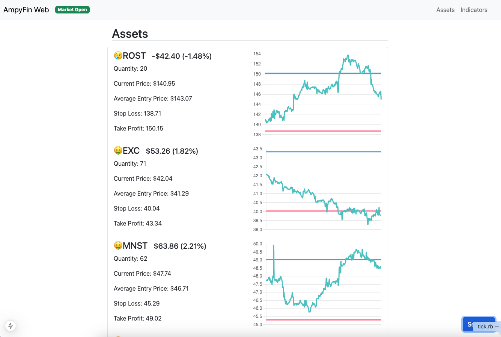

This provides a simple web structure for reporting on [AmpyFin](https://github.com/yeonholee50/AmpyFin)



## Getting Started

Declare the following environment variables.

```
MONGODB_URI='YOURMONGDBURI'
APCA_API_KEY_ID='ALPACAAPIKEY'
APCA_API_KEY_SECRET='ALPACASECRETKEY'
```

The Alpaca key is used for charting current assets.

@see `sample.env`

Then run your server

```bash
npm run dev
# or
yarn dev
# or
pnpm dev
# or
bun dev
```

Open [http://localhost:3000](http://localhost:3000) with your browser to see the result.

## Releases

AmpyFin Web follows the same version as AmpyFin to ensure compatibility with any DB changes.

## Contributing

Please fork and use a feature branch. Then submit a PR from the feature branch fork.

